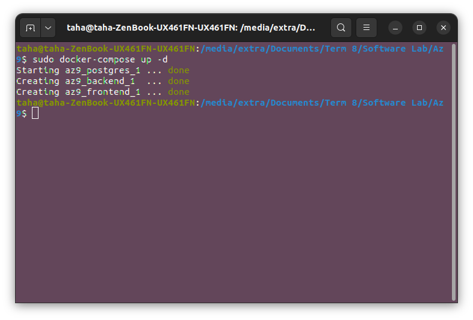

# software-engineering-lab-session9

  | `Person Number` | `First Name` | `Last Name` | `Student Number` |
  |:---------------:|:------------:|:-----------:|:----------------:|
  | `First Person` | Moahmmad Taha | Jahani-Nezhad | 98101363  |
  | `Second Person` | Iman | Alipour | 98102024 |
  
---


## مراحل آزمایش
در این آزمایش می‌خواهیم کار با داکر و معماری میکروسرویس را یاد بگیریم.

به همین منظور، سرویس Docker و همچنین پلاگین Docker-Compose را طبق توضیحاتی که در [این لینک](https://docs.docker.com/engine/install/ubuntu/) آورده شده است، نصب می‌کنیم.


### توضیحات کلی پروژه
ابتدا یک معرفی کلی از پروژه‌ای که قصد ایجاد آن‌را داریم ارائه می‌کنیم و سپس مراحل ایجاد آن‌را بررسی می‌کنیم.

پروژه‌ی ما سه بخش کلی دارد:
- سرویس فرانت‌اند: سرویسی که کاربر با آن تعامل می‌کند. در اینجا این سرویس یک سری فایل استاتیک شامل html و js و css می‌باشد. برای صرفه‌جویی در زمان، از پروژه‌ی ماشین‌حسابی که در آزمایش یکم پیاده‌سازی کرده‌ایم استفاده می‌کنیم.
- سرویس بک‌اند: این سرویس دو API کلی ارائه می‌کند. در واقع این سرویس به یک دیتابیس متصل شده و عملیاتی که کاربر انجام داده است را ذخیره می‌کند. ای‌پی‌آی اول مربوط به ذخیره‌ی یک مورد جدید در دیتابیس و ای‌پی‌آی دوم برای گرفتن همه‌ی محاسبات کاربر می‌باشد.
- سرویس دیتابیس: برای ذخیره‌ی اطلاعات محاسباتی کاربر، از یک Table ساده در دیتابیس پستگره استفاده می‌کنیم.

### سرویس فرانت‌اند
از آنجایی که سرویس فرانت‌اند ما تنها متشکل از تعدادی فایل ثابت است، برای Serve کردن آن‌ها به یک وب‌سرور ساده مانند Nginx نیاز داریم.

بنابراین تنها کاری که باید انجام دهیم این است که یک Image جدید برای داکر بنویسیم که از ایمیج پایه‌ی Nginx استفاده می‌کند. همچنین پس از  ایجاد این Image، فایل‌های مربوط به فرانت‌اند در محل مشخص `/usr/share/nginx/html/` کپی می‌شوند و به طور خودکار توسط انجینکس سرو خواهند شد.

محتوای Dockerfile نوشته شده برای این سرویس بسیار ساده بوده و تنها دو بخش دارد:
```
FROM nginx:latest
COPY ./files /usr/share/nginx/html/
```
در خط ابتدایی، ایمیج پایه که از آن استفاده می‌کنیم را تعیین می‌کنیم. در خط دوم نیز فایل‌های گفته شده را در پوشه‌ی گفته شده کپی می‌کنیم.

### سرویس بک‌اند
این سرویس یک مقدار پیچیدگی بیشتری دارد. برای پیاده‌سازی بک‌اند تصمیم گرفتیم که از فریم‌ورک جنگو استفاده کنیم. دلیل این انتخاب سادگی ایجاد پروژه و همچنین Lightweight بودن فریم‌ورک می‌باشد.

ابتدا یک Virtualenv جدید ایجاد می‌کنیم و جنگو را روی آن نصب می‌کنیم. پس از ایجاد پروژه و نصب تمامی نیازمندی‌ها، مدل `HistoryItem` که نماینده‌ی یک محاسبه‌ی کاربر می‌باشد را می‌نویسیم. این مدل تنها دو فیلد دارد که اولی مربوط به عبارت محاسبه شده و دومی مربوط به نتیجه ‌ی محاسبه می‌باشد.

همچنین دو API، یکی با متد GET و دیگری با متد POST می‌نویسیم. وظیفه‌ی این دو API پیشتر ذکر شده‌اند.

پس از تکمیل همه‌ی نکات، نیازمندی‌های پروژه را با استفاده از دستور `pip freez >> requirements.txt` استخراج می‌کنیم. اکنون نیاز داریم که Dockerfile مربوط به این سرویس را نیز بنویسیم.

از آنجایی که این پروژه از پایتون استفاده می‌کند، ایمیج پایه‌ای که از آن استفاده می‌کنیم ایمیج پایتون خواهد بود.

همچنین، چون این سرویس مانند یک Server عمل می‌کند، باز هم نیاز به یک وب‌سرور مانند انجینکس خواهیم داشت. (اگرچه می‌توان بعضا با دستورات خود جنگو سرور را اجرا کرد اما این روش برای Deployment توصیه نمی‌شود و استفاده از یک وب‌سرور امنیت بیشتری دارد)

بنابراین، پس از ساخته شدن ایمیج باید دستورات زیر را اجرا کنیم. دستور اول مربوط به نصب انجینکس و نیازمندی‌های آن می‌باشد. دستور دوم برای کپی کردن یک تنظیمات پیش‌فرض و از قبل نوشته شده برای انجینکس می‌باشد و دستور سوم برای ایجاد کردن دسترسی انجینکس به فایل‌های log می‌باشد:

```
RUN apt-get update && apt-get install nginx vim -y --no-install-recommends
COPY nginx.default /etc/nginx/sites-available/default
RUN ln -sf /dev/stdout /var/log/nginx/access.log \
    && ln -sf /dev/stderr /var/log/nginx/error.log
```

بعد از اینکه انجینکس به درستی نصب و تنظیم شد، باید فایل‌های مربوط به جنگو را به داخل ایمیج کپی کنیم و همچنین requirementهایی که استخراج کرده‌ایم را نصب کنیم. دستورات زیر تنظیمات راه‌اندازی جنگو و تعین سطوح دسترسی به فایل‌ها را انجام می‌دهند:

```
RUN mkdir -p /opt/app
RUN mkdir -p /opt/app/pip_cache
RUN mkdir -p /opt/app/calculator_back
COPY requirements.txt start-server.sh /opt/app/
COPY .pip_cache /opt/app/pip_cache/
COPY calculator_back /opt/app/calculator_back/
WORKDIR /opt/app
RUN pip install -r requirements.txt --cache-dir /opt/app/pip_cache
RUN chown -R www-data:www-data /opt/app
```

و در نهایت، پورت ۸۰۲۰ را روی این ایمیج باز می‌کنیم و یک فایل Shell که از پیش برای راه‌اندازی سرور جنگو نوشته‌ایم را اجرا  می‌کنیم:

```
EXPOSE 8020
STOPSIGNAL SIGTERM
CMD ["/opt/app/start-server.sh"]
```
لازم به ذکر است که فایل `start-server.sh` دستوراتی است که با استفاده از سرویس WSGI، فریم‌ورک جنگو را راه‌اندازی می‌کند.


### سرویس دیتابیس
راه‌اندازی این سرویس نیاز به داکرفایل جداگانه و نوشتن Custom Image ندارد. یکی از دلایل انتخاب پستگره و ایجاد سرویس دیتابیس این بود که کار با ایمیج‌های آماده را نیز آموخته و تمرین کنیم.

بنابراین در اینجا به همین توضیحات اندک در مورد ایمیج آماده‌ی Postgres بسنده می‌کنیم و در مرحله‌ی بعد و هنگام نوشتن فایل docker-compose توضیحات تکمیلی مربوط به این بخش را ارائه خواهیم کرد.


### نوشتن docker-compose.yml
پلاگین docker-compose که به طور پیش‌فرض روی داکرهای با ورژن جدید نصب می‌باشد، هنگامی استفاده می‌شود که بخواهیم چند ایمیج مختلف را به طور همزمان build و run کنیم.

محتویات فایل docker-compose ما به صورت زیر می‌باشد. در ادامه توضیحات مربوط به آن آورده شده است:

```
version: "3.3"

services:
  postgres:
    image: postgres:15.1
    ports:
    - "7887:5432"
    environment:
      POSTGRES_PASSWORD: samplepass
    volumes:
    - $HOME/docker/volumes/Az9/postgres:/var/lib/postgresql/data
  
  frontend:
    image: frontend
    ports:
    - "3000:80"
  
  backend:
    image: backend
    ports:
    -  "8000:8020"
    depends_on:
    - postgres
    environment:
      DJANGO_SUPERUSER_USERNAME: admin
      DJANGO_SUPERUSER_PASSWORD: admin
      DJANGO_SUPERUSER_EMAIL: taha7900@gmail.com

```
خط اول که ورژن این فایل و ورژن مربوط به docker-compose را مشخص می‌کند و نکته‌ی خاصی ندارد. اما در بخش سرویس‌ها، ما می‌توانیم سه سرویس مختلف را مشاهده کنیم:
- سرویس دیتابیس: همانطور که گفته شد، برای ایجاد این سرویس از یک ایمیج از پیش آماده استفاده کرده‌ایم. در ادامه، بیان شده که پورت ۷۸۸۷ سیستم (همان localhost) روی پورت ۵۴۳۲ این کانتینر مپ خواهد شد. در ادامه یک سری متغیرهایی که این ایمیج برای راه‌اندازی استفاده می‌کند آورده شده و در خط آخر نیز مشخص شده که اطلاعات مربوط به این ایمیج باید در کدام بخش حافظه‌ی واقعی سرور ما ذخیره شوند.
- سرویس فرانت‌اند: این سرویس از ایمیج frontendیی که پیشتر در مورد آن توضیح داده شد استفاده می‌کند. همچنین پس از ساخته شدن کانتینر، پورت ۳۰۰۰ سیستم روی پورت ۸۰ کانتینر مپ خواهد شد که این یعنی با باز کردن لینک `localhost:3000`، عملا درخواستی به انجینکس این کانتینر ارسال خواهد شد.
- سرویس بک‌اند: این سرویس نیز همانند سرویس قبلی از یک custom image استفاده می‌کند. پورت ۸۰۰۰ سیستم نیز روی پورت ۸۰۲۰ (همان پورتی که در داکرفایل باز کردیم) مپ می‌شود. یک سری متغیرهای محیطی نیز برای این ایمیج تعریف شده. نکته‌ای که در این کانتینر حائز اهمیت است این است که بیان شده این کانتینر نیازمند سرویس دیتابیس می‌باشد. با اضافه کردن این شرط، تا زمانی که سرویس دیتابیس اجرا نشده، داکر این سرویس را اجرا نخواهد کرد.

نکته‌ی دیگری که لازم است در اینجا ذکر کنیم، نحوه‌ی ارتباط دو سرویس postgres و backend با یکدیگر می‌باشد. زیرا می‌دانیم که سرویس بک‌اند نیازمند ارسال کوئری به سرویس دیتابیس می‌باشد. این ارتباط از دو طریق می‌تواند صورت گیرد:
1. سرویس بک‌اند درخواست‌های خود را در هاست localhost روی پورت 7887 ارسال کند.
2. سرویس بک‌اند درخواست‌های خود را در هاست postgres و روی پورت 5432 ارسال کند. علت کار کردن این موضوع این است که داکر با ایجاد هر کانتینر، عملا یک HostName با همان نام روی سیستم ایجاد می‌کند. ما در این پروژه این روش را انجام دادیم.

_نکته_: توجه کنید که در فایل داکر کامپوز امکان build کردن ایمیج‌های custom نیز وجود دارد اما در اینجا ابتدا جداگانه imageها را build می‌کنیم و سپس با استفاده از docker-compose صرفا آن‌ها را اجرا می‌کنیم.

### اجرای نهایی سرویس‌ها
ابتدا در پوشه‌ی `calculator_back`، دستور زیر را اجرا می‌کنیم:
```
sudo docker build -t backend .
```
این دستور به موتور داکر دستور می‌دهد که Dockerfile موجود در پروژه‌ی حاضر را اجرا کند و یک ایمیج به نام backend بسازد.

تصویر زیر از فرایند build شدن این ایمیج می‌باشد:


شبیه همین دستور را در پوشه‌ی `calculator_front` نیز اجرا می‌کنیم:
```
sudo docker build -t frontend .
```
تصویر‌ زیر از فرایند build شدن این ایمیج می‌باشد:


پس از ساخته شدن همه‌ی ایمیج‌ها، دستور `sudo docker images -a` که معادل دستور داده شده در دستور کار است را اجرا می‌کنیم تا لیست ایمیج‌های موجود در سیستم را ببینیم:


توجه کنید که تعدای از این ایمیج‌ها از قبل در سیستم وجود داشته‌اند. همچنین، ایمیج backend و frontend را ابتدای لیست می‌بینیم که به درستی ایجاد شده‌اند.

اکنون باید این ایمیج‌ها را اجرا کنیم. در پوشه‌ی root پروژه دستور `sudo docker-compose up -d` را اجرا می‌کنیم.

با اجرای این دستور و گذشتن مدت کمی، خروجی زیر مشاهده می‌شود:


اکنون دستور `sudo docker ps` را اجرا می‌کنیم تا لیست کانتینرهای روشن را مشاهده کنیم:


همانطور که در تصویر مشاهده می‌شود، تمامی کانتینرها به درستی اجرا شده‌اند. همچنین کانتینر shadow-tls که مدت زیادی است روشن بوده، از قبل در سیستم وجود داشته است و به این پروژه مرتبط نیست.


### تست سرویس‌ها
اکنون باید سرویس‌ها را تست کنیم. همانطور که بالاتر عنوان شد، پورت ۳۰۰۰ سیستم روی پورت ۸۰ کانتینر مربوط به سرویس فرانت‌اند مپ شده است. در نتیجه با باز کردن لینک `localhost:3000` باید صفحه‌ی ابتدایی پروژه فرانت را مشاهده کنیم:


همچنین، با استفاده از نرم‌افزار postman دو ریکوئست مختلف به سرویس بک‌اند می‌زنیم تا صحت عمل‌کرد آن‌را نیز آزمایش کنیم:

در تصویر فوق، یک ریکوئست POST به این سرویس ارسال شده. همانطور که مشاهده می‌شود، سرویس پاسخ داده و همچنین آدرس ارسال نیز `localhost:8000` است که همان پورت مپ شده به کانتینر می‌باشد.


در تصویر فوق، همانطور که مشاهده می‌شود، دو مورد history که یکی از آن‌ها را به تازگی ایجاد کرده‌ایم در پاسخ ارسال شده. با ارسال این درخواست توانستیم متوجه شویم که اولا سرویس دیتابیس نیز به درستی کار می‌کند و همچنین ارتباط بین این دو سرویس به درستی انجام شده است.


### سخن پایانی
از دستیاران آموزشی عزیز که در این درس ما را همراهی کردند تا موارد مفید مهندسی نرم‌افزار را به صورت عملی بیاموزیم و همچنین در سختی‌های مربوط به ددلاین‌ها و تمدیدن آن‌ها ما را یاری کردند، سپاس‌گزاریم.