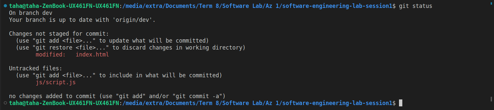

# software-engineering-lab-session1

  | `Person Number` | `First Name` | `Last Name` | `Student Number` |
  |:---------------:|:------------:|:-----------:|:----------------:|
  | `First Person` | Moahmmad Taha | Jahani-Nezhad | 98101363  |
  | `Second Person` | Iman | Alipour | 98102024 |
  
---
  
  # مراحل انجام آزمایش
برای انجام این آزمایش، پروژه‌ی انتخابی ما یک ماشین‌حساب ساده تحت وب می‌باشد. برای انجام این پروژه صرفا از html و css و javascript خام استفاده می‌کنیم.


در حین ایجاد پروژه برای لحاظ نشدن فایل‌های بی‌ربط مربوط به fontهایی که به پروژه اضافه کردیم و همچنین پوشه‌ های بی‌ربطی که توسط سیستم‌هامل ساخته شده‌اند، فایل‌ها و پوشه‌های زیر را در .gitignore قرار دادیم تا توسط گیت ترک نشوند.

```
.DS_Store
.Rhistory
``` 

همچنین برای انجام این پروژه کامیت‌های زیر را انجام دادیم:


برای develope کردن این پروژه از سه برنچ استفاده کردیم که در ادامه مشاهده می‌کنید:


برنچ master برنچ اصلی ماست که همانطور که مشاهده می‌کنید یک برنچ محافظت شده است، همچنین از برنچ dev برای انجام برنامه‌نویسی و از برنچ hotfix برای انجام برخی از عملیات‌های debugging استفاده می‌کنیم.

همچنین همانطور که پیش‌تر گفتیم شاخه‌ی master را محافظت کرده‌ایم تا امکان مرج کردن مستقیم با آن وجود نداشته باشد و صرفا از طریق ایجاد pull request این امکان وجود داشته باشد:


یک نمونه از اجرای pull کردن و در نتیجه‌ی آن ادغام کردن (merge) با استفاده از command line  در ادامه آمده است:


همچنین تصویرهای زیر نتیجه‌ی برطرف کردن دو conflict متفاوت است که در command line برطرف شده‌اند.


در نهایت خروجی پروژه‌ی ما در شکل زیر آمده است:


برای پیاده‌سازی این ماشین‌حساب ساده ابتدا بخش طراحی را با استفاده از html و css انجام دادیم و سپس بخش منطق ان را با استفاده از javaScript در برنچ dev ایجاد کردیم. همچنین در ادامه در برنچ hotfix انواع اصلاحات خاص مانند اینکه نتوان در یک عدد بیش از یک علامت ممیز استفاده کرد یا نحوه‌ی پرانتز گذاری درست و همچنین اعمال محدودیت عدم امکان قرار داردن operatorهای پشت سر هم را اعمال کردیم.

در ادامه می‌توانید خروجی برخی از دستورات گیت که در هنگام انجام پروژه استفاده کردیم را مشاهده کنید.

- استفاده از دستور `git status`:



- استفاده از دستور `git add`:


- استفاده از دستور `git commit`:


- استفاده از دستور `git pull`:


- استفاده از دستور `git push`:


- استفاده از دستور `git branch`:


- استفاده از دستور `git log`:


- استفاده از دستور `git diff`:


- استفاده از دستور `git fetch`:


- استفاده از دستور `git checkout`:


---


  # پرسش‌ها

  ## پرسش ۱: پوشه‌ی .git چیست؟ چه اطلاعاتی در آن ذخیره می‌شود؟ با چه دستوری ساخته می‌شود؟
این پوشه تمام اطلاعاتی که برای پروژه لازم است و تمام اطلاعات مربوط به
commit
ها، آدرس 
remote repository
 که در آن کدهای ما نگهداری می‌شود و ... را در خود نگه می‌دارد. همچنین شامل یک فایل log است که تاریخچه commit را ذخیره می کند. در واقع این پوشه پس از ران کردن کامند `git init` ایجاد می‌شود . به مرور زمان به آن باقی متادیتاهای مرود نیاز اضافه می‌شوند و تکمیل می‌شود.

## پرسش ۲: منظور از atomic بودن در atomic commit و atomic pull-request چیست؟
منظور از atomic بودن این است که کامیتی که انجام می‌دهیم یا pull request که ایجاد می‌کنیم تغییرات بسیار زیاد و بزرگی را نداشته باشد و کوچک و متمرکز بر چیز خاصی باشد، مثلا در یک کامیت چندین کلاس یا تابع را پیاده‌سازی نکنیم و هر کدام را در یک کامیت انجام دهیم، همچنین در pull request منظور این است که این کار را برای چندین فیچر انجام ندهیم و برای هر فیچر یک pull request ایجاد کنیم. اینگونه ترک کردنی که با گیت انجام می‌دهیم بهتر است و همچنین maintain کردن کدها و رفع باگ‌ها و ... بهینه‌تر انجام می‌گیرند.


## پرسش ۳: تفاوت دستورهای fetch و pull و merge را بیان کنید.
دستور
`git pull`
ابتدا یک 
`git fetch`
انجام می‌دهد و طی آن از آدرس ریپازیتوری‌ای که مشخص کرده‌ایم محتواهای جدید را دانلود می‌کند و سپس یک دستور 
`git merge` 
اجرا می‌کند تا این محتوا را با محوایی که به صورت 
local داریم ادغام کند. اگر در این استیت نتواند کد‌ها را ادغام کند به اصطلاح conflict رخ داده و ما باید آن را به صورت دستی برطرف کنیم.

## پرسش ۴: تفاوت چهار دستور reset و revert و rebase و restore را بیان کنید.

دستور 
`git restore` 
فایل‌های یک دیرکتوری یا پوشه‌ی خاص را بازیابی می‌کند، دستور 
`git reset` 
 دیرکتوری کد فعلی را به یک کامیت خاص برمی‌گرداند. در واقع از آن برای undo کردن کامیت‌ها استفاده می‌شود.
 دستور 
 `git revert`
 مانند `git reset` است اما برای هر تغییر یک کامیت هم انجام می‌دهد.
 دستور `git rebase` تعدادی کامیت را به یک بیس دیگر می‌برد.

مثال زیر را در نظر بگیرید.
```
     E - F - G ----- feature1
    /
A - B - C - D --------- master
```
فرض کنید به برنچ مستر برویم و این کامند را اجرا کنیم، حاصل به شکل زیر در می‌آید. 

```
            E - F - G ----- feature1
            /
A - B - C - D --------- master
```

## پرسش ۵: منظور از stage چیست؟ دستور stash چه کاری را انجام می‌دهد؟
قبل از کامیت کردن از دستور `git stage` استفاده می‌کنیم و در واقع فایل‌ها را به `staged files` اضافه می‌کنیم تا آماده‌ی کامیت شدن بشوند. همچنین `stash` برای این استفاده می‌شود تا تغییرات را `stash` می‌کند تا بتوانیم روی چیز دیگری کار کنیم و آن را کامیت نکنیم، در واقع به نوعی به ما کمک می‌کند تا `atomic commit` انجام دهیم.


## پرسش ۶: مفهوم snapshot به چه معناست؟
عبارت `snapshop` 
 به معنای استیت یک چیز در یک لحظه‌ی خاص از زمان است در واقع در کانتکست گیت، snapshot از محتوای یک پوشه‌ یا برنچ (شاخه) خاص است، در واقع هر commit شامل یک متادیتا (پیام و نویسنده و تاریخ) است و یک snapshot (از محتوای درخت پروژه‌ی ما).